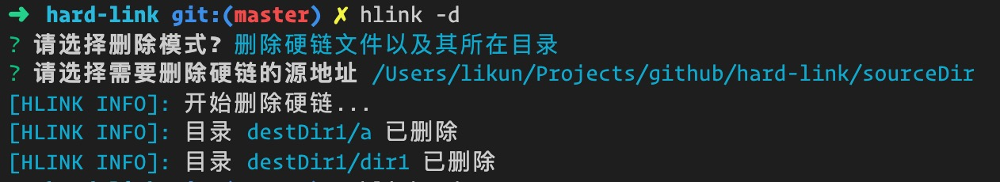

#### 20201209
- __新增__：删除采用ui交互方式，不用担心创建的硬链目录记不住, 如果你是通过 `hlink` 创建的硬链，创建记录会被记录，可以使用 `hlink -d` 进行ui交互删除

- __修复__：创建的硬链被改名时，无法检测到，导致重复创建的问题
- __新增__：默认连接的文件后缀包含有了"mp4", "flv", "f4v", "webm", "m4v", "mov", "cpk", "dirac", "3gp", "3g2", "rm", "rmvb", "wmv", "avi", "asf", "mpg", "mpeg", "mpe", "vob", "mkv","ram", "qt", "fli", "flc", "mod", "iso"

