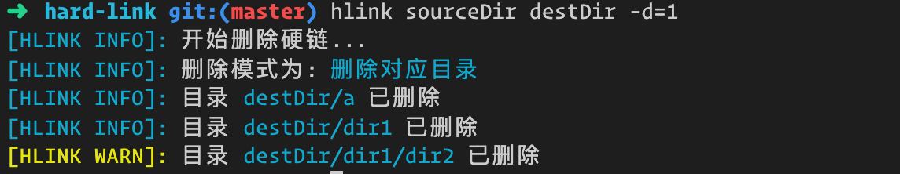

# hlink

[![npm package][npm]][npm-url]
[![node version][node]][node-url]
[![npm download][npm-download]][npm-download-url]

## 所需环境：
nodejs 10 以上；

## 安装
```bash
$ npm install -g hlink

# 查看帮助

$ hlink --help
```
## 功能：
1. 批量创建源地址下面所有视频文件 硬链 到目标地址
2. 重复硬链检测，就算硬链接已改名也能检查到
3. 批量删除源地址在目标地址所创建的硬链

## 使用


## 效果截图





## 威联通关联环境变量
> 由于威联通重启后会重置部分配置，而且威联通安装node后默认没有设置环境变量，所以需要配置开机启动脚本来进行自动配置 hlink 到环境变量中，不然很麻烦

1. ssh 登录你的威联通机器
执行以下命令

```bash
$ mount $(/sbin/hal_app --get_boot_pd port_id=0)6 /tmp/config
```

2. 编辑autorun.sh脚本

```bash
$ vim /tmp/config/autorun.sh
```

添加以下脚本到autorun.sh
```
ln -s  /share/CACHEDEV1_DATA/.qpkg/NodeJS/bin/hlink /usr/local/bin/hlink
```


其中`/share/CACHEDEV1_DATA/.qpkg/NodeJS/bin/hlink` 为你npm安装后的hlink 路径，根据各自的路径进行更换

3. 给autorun.sh添加执行权限
```
$ chmod +x /tmp/config/autorun.sh
```

4. 开启用户自定义脚本

`控制台` > `硬盘` > `启动时运行用户定义的进程` 打上勾，最后别忘记点击`应用`


5. 卸载`/tmp/config`

```bash
$ umount /tmp/config
```

# 赞助作者

维护不易，如果可以，请我喝一杯咖啡😄


# License

[MIT][license-url]

[npm]: https://img.shields.io/npm/v/hlink.svg
[npm-url]: https://www.npmjs.com/package/hlink

[node]: https://img.shields.io/node/v/hlink.svg
[node-url]: https://nodejs.org

[npm-download-url]: https://npmjs.com/package/hlink
[npm-download]: https://img.shields.io/npm/dm/hlink.svg

[license-url]: https://github.com/likun7981/hlink/blob/master/LICENSE
[license]: http://img.shields.io/npm/l/hlink.svg?style=flat
